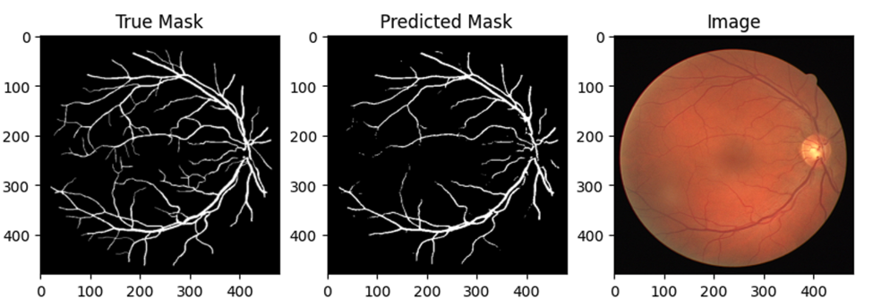
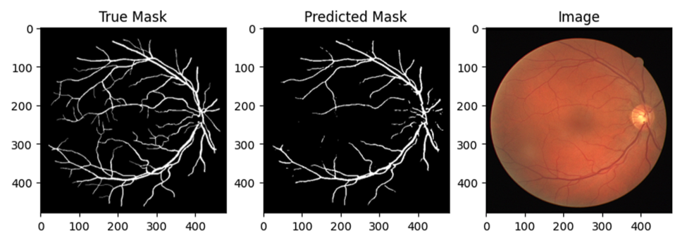
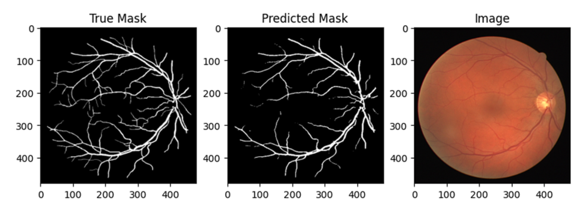

# Retinal Vessel Segmentation

Retinal vessel segmentation holds significant importance in both ophthalmology and medical imaging. This task entails the identification and delineation of blood vessels within retinal images, crucial for diagnosing and treating a range of retinal diseases, such as diabetic retinopathy and glaucoma. This project focuses on comparing the performance of the IterNet Model, introduced by Li et al. (2020), with two established models: UNet and Vision Transformers. Below are the training results for each model.

## Dataset

The dataset used in this project is the DRIVE dataset, which is widely utilized in retinal vessel segmentation. The DRIVE dataset was introduced by Staal et al. in 2004 and consists of retinal fundus images obtained from 40 subjects. Each subject's retina has been meticulously examined, resulting in 20 images for training and 20 for testing. 

## Training Results

The performance metrics of several segmentation models utilized in this project with the DRIVE dataset.

| Model Name                                       | Dice Score | IoU Index | Tversky Score | F1 Score |
|--------------------------------------------------|------------|-----------|---------------|----------|
| [IterNet](https://github.com/conscienceli/IterNet) | 0.7691     | 0.6262    | 0.789         | 0.7416   |
| Transformer - Patchers                           | 0.7617     | 0.6157    | 0.7699        | 0.7279   |
| UNet                                             | 0.7325     | 0.5792    | 0.7764        | 0.7131   |

## Test Images

### UNet

 

### Vision Transformer - Patchers

### IterNet

## Usage

This repository provides resources for retinal vessel segmentation, including datasets, model implementations, and evaluation scripts. Researchers and practitioners in the field of ophthalmology and medical imaging can utilize these resources to develop and validate segmentation algorithms for retinal vessel analysis.

## Note

This project showcases state-of-the-art performance in retinal vessel segmentation, offering benchmark metrics for comparison with other segmentation models. For inquiries, collaborations, or further information, please contact samadnajm.sn@gmail.com

## License

This project is licensed under the Apache License.

---
Feel free to customize the README further to include additional information or specific instructions for users.
